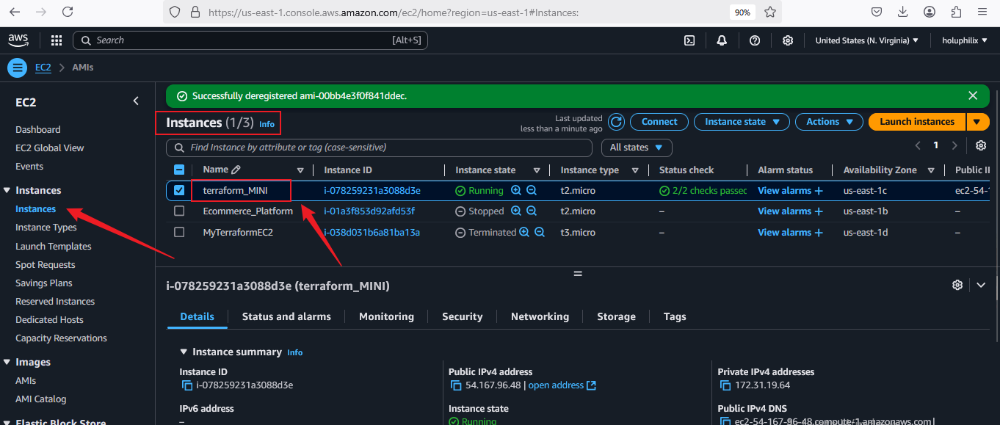
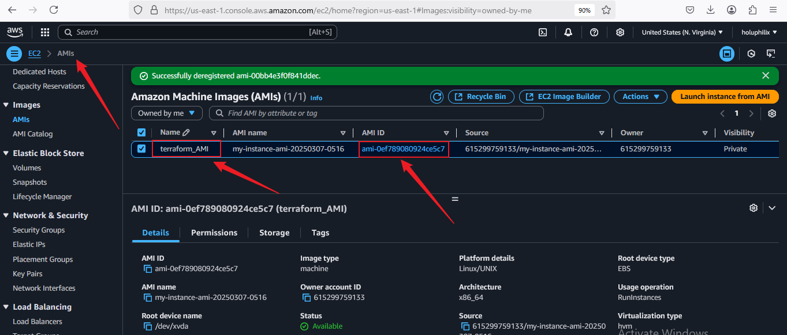
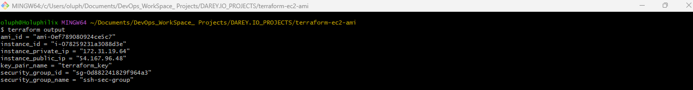
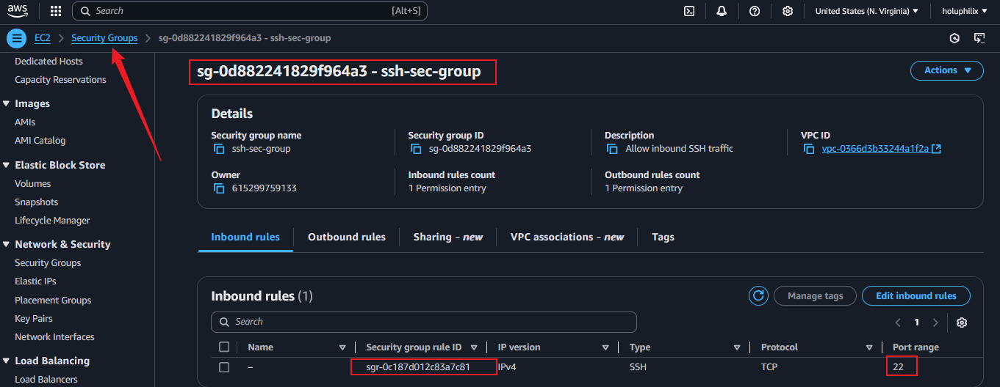

# Terraform Project: EC2 Instance and AMI Automation

## Overview

This project demonstrates how to use Terraform to create an EC2 instance on AWS and automate the creation of an AMI from the instance. The following objectives are covered:

1. **Terraform Configuration:** Writing basic Terraform configuration files.
2. **EC2 Instance Creation:** Provisioning an EC2 instance using Terraform.
3. **AMI Creation:** Automating the creation of an AMI from the running instance.

## Prerequisites

Before executing the Terraform scripts, ensure the following requirements are met:

- Terraform installed on your local machine.
- AWS CLI configured with appropriate credentials.
- SSH key pair available for instance access.

## Getting Started

### 1. To create Project Directory

To begin, create the project directory named **terraform-ec2-ami**, navigate into it

```sh
mkdir terraform-ec2-ami
cd terraform-ec2-ami
```

### 2. Terraform Configuration

The Terraform configuration file (`main.tf`) includes the provider definition and resources needed to deploy an EC2 instance and create an AMI.

#### **Terraform Provider Configuration**

```hcl
# Provider Block
provider "aws" {
  region = "us-east-1" # Change to your desired AWS region
}
```

#### **Default VPC Configuration**

```hcl
# Automatically find the default VPC
data "aws_vpc" "default" {
  default = true
}
```

### 3. EC2 Instance Creation

The following script provisions an EC2 instance with a security group and SSH key pair:

#### **Create an SSH Key Pair**

```hcl
resource "aws_key_pair" "terraform_key" {
  key_name   = "terraform_key"
  public_key = file("C:/Users/oluph/.ssh/id_rsa.pub") # Ensure this file exists
}
```

#### **Create a Security Group for SSH Access**

```hcl
resource "aws_security_group" "ssh-sec-group" {
  name        = "ssh-sec-group"
  description = "Allow inbound SSH traffic"
  vpc_id      = data.aws_vpc.default.id  

  ingress {
    from_port   = 22    
    to_port     = 22    
    protocol    = "tcp"
    cidr_blocks = ["0.0.0.0/0"]  # Allow SSH from anywhere (consider restricting to your IP)
  }

  egress {
    from_port   = 0
    to_port     = 0
    protocol    = "-1"
    cidr_blocks = ["0.0.0.0/0"]
  }
}
```

#### **Create an EC2 Instance**

```hcl
resource "aws_instance" "my_instance" {
  ami           = "ami-014d544cfef21b42d"  # Replace with a valid AMI ID for us-east-1
  instance_type = "t2.micro"
  key_name      = aws_key_pair.terraform_key.key_name # Use the created key pair

  vpc_security_group_ids = [aws_security_group.ssh-sec-group.id]
  associate_public_ip_address = true

  tags = {
    Name = "terraform_MINI"
  }
}
```

### 4. AMI Creation

A short delay is introduced to ensure the instance is fully operational before creating an AMI.

#### **Wait Before Creating the AMI**

```hcl
resource "time_sleep" "wait_for_instance" {
  depends_on      = [aws_instance.my_instance]
  create_duration = "30s"  # Adjust as needed to allow instance startup
}
```

#### **Create an AMI from the EC2 Instance**

```hcl
resource "aws_ami_from_instance" "my_ami" {
  name               = "my-instance-ami-${formatdate("YYYYMMDD-HHmm", timestamp())}"
  source_instance_id = aws_instance.my_instance.id
  depends_on         = [time_sleep.wait_for_instance]  # Ensures instance is fully ready

  tags = {
    Name = "terraform_AMI"
  }
}
```

#### 🛠 **Experimenting with Terraform Configuration**

- To Modify your Terraform setup,

- Change the EC2 instance type

- Add additional resources (e.g., more EC2 instances, S3 bucket, IAM roles, etc.)

- Modify existing configurations (e.g., security group rules)

🔹**Change the EC2 Instance Type**

I modified my instance type from t2 micro to t2 small, and added another EC2 instance in my main.tf:

```hcl
resource "aws_instance" "additional_instance" {
  ami                    = "ami-014d544cfef21b42d"  # Replace with a valid AMI ID for us-east-1
  instance_type          = "t2.small"
  key_name               = aws_key_pair.terraform_key.key_name # Use the created key pair
  vpc_security_group_ids = [aws_security_group.ssh_sec_group.id]
  associate_public_ip_address = true

  tags = {
    Name = "Additional_Instance"
  }
}
```

## Usage

To execute the Terraform configuration, follow these steps:

1. **Initialize Terraform:**
   ```sh
   terraform init
   ```
2. **Plan the deployment:**
   ```sh
   terraform plan
   ```
3. **Apply the changes:**
   ```sh
   terraform apply -auto-approve
   ```
4. **Check the AMI in AWS Console:**
   - Navigate to **EC2 Dashboard → AMIs**
   - Verify that the AMI has been successfully created.

## Cleanup

To destroy the created resources and avoid unnecessary costs, run:

```sh
terraform destroy -auto-approve
```

## Screenshots

Below are screenshots of the Terraform process and AWS console to verify resource creation.

### **EC2 Instance Created**


### **AMI Successfully Created**


### **Terraform Apply Output**


### **Security Group Created**


## Conclusion

This project successfully demonstrated how to use Terraform to:

- Define AWS provider configurations.
- Deploy an EC2 instance with security groups and SSH access.
- Automate the creation of an AMI from the running EC2 instance.

By following these steps, you can efficiently manage AWS infrastructure using Infrastructure as Code (IaC) principles with Terraform.

### 5. Steps to Add the Project to GitHub

#### **Step 1: Initialize a Git Repository**
Navigate to your project directory and initialize Git:

```sh
git init
```

#### **Step 2: Add Project Files**
Add all Terraform files and the `README.md` to the Git repository:

```sh
git add .
```

#### **Step 3: Commit the Files**
Commit the changes with a message:

```sh
git commit -m "Initial commit - Terraform EC2 and AMI automation"
```

#### **Step 4: Create a GitHub Repository**
- Go to [GitHub](https://github.com/) and create a new repository.
- Copy the repository URL.

#### **Step 5: Link Local Repository to GitHub**
Replace `your-github-repo-url` with your actual repository URL:

```sh
git remote add origin https://github.com/Holuphilix/terraform-ec2-ami.git
```

#### **Step 6: Push Code to GitHub**
```sh
git branch -M main
git push -u origin main
```

**Author:** Philip Oluwaseyi Oludolamu
**Date:** March 2025

